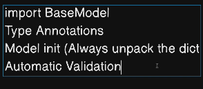
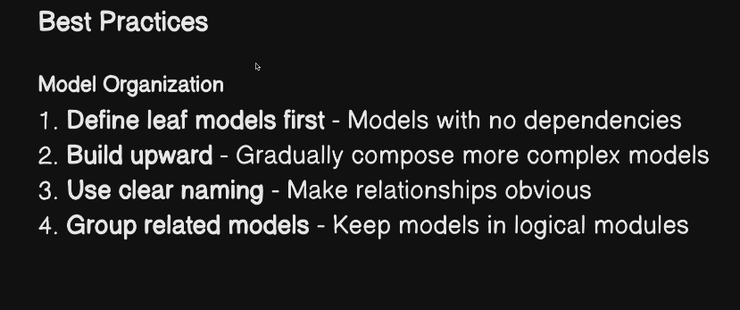
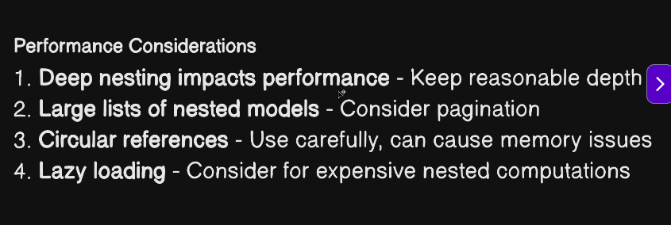
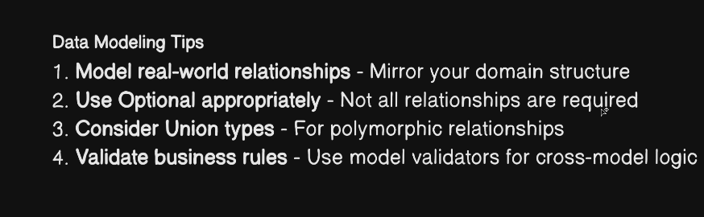

# what is pydantic
        * data validation  -> not change data type ( styring to int ❌)
        * setting management -> when loading some config files (env) in fast api 

use in
* data parsing-> raew data into structure
 * api develop
 * config management 
 * data serilization/ deserilization 

 installation 

# python3 -m venv venv
# source venv/bin/activate
 # pip install --upgrade pip

 # pip install pydantic

pydantic serialzation

